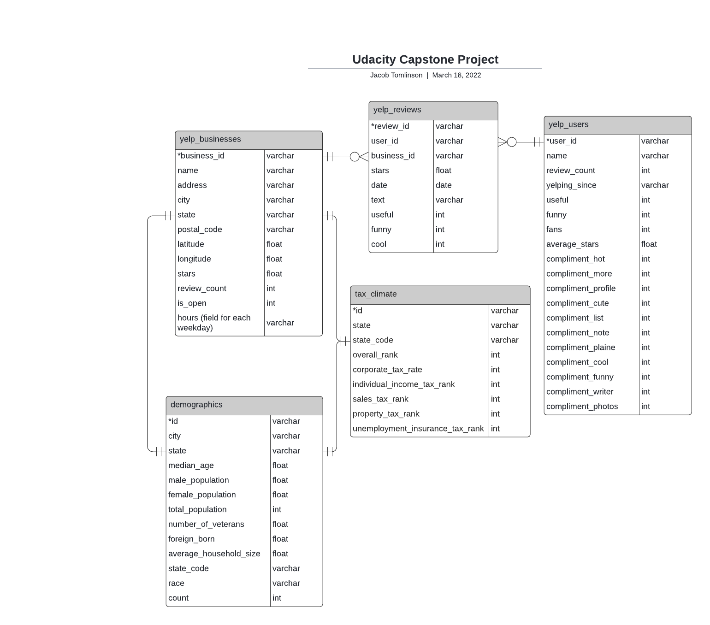
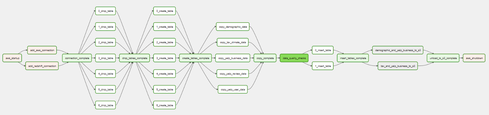

# Udacity Capstone Project

**Overview**: An ETL pipeline which gathers and transforms data on Yelp businesses, reviews and users, demographic data about cities in the United States, and the tax climate of each state.

**Table of Contents**

1. [Scope the Project and Gather Data](#scope-and-gathering-data)
2. [Data Assessment](#data-assessment)
    1. [Yelp Dataset](#yelp-dataset)
    2. [Demographics of U.S. Cities](#demographics-of-us-cities)
3. [Data Model Definition](#data-model-definition)
4. [ETL Process](#etl-process)
5. [Example Queries](#example-queries)
6. [How to use this project](#how-to-use-this-project)
7. [Concluding thoughts](#concluding-thoughts)

## Scope and Gather Data

### Scope

The idea of this project is to gather data from a couple of sources, which can be used together for analysis. In this project I plan to use data from Yelp, the Census Bureau, and the Tax Foundation. The end solution will provide data analysts and data scientists a structured data set and give them the ability to query and/or create more sophisticated models to answer interesting questions about businesses, reviewers or businesses, and control for things like the tax climate and demogrpahics. To do this, I will use the following tools: Python, Apache Airflow, PySpark

Once this data is compiled and transformed for use, the end user will be able to perform queries and create statistical models to answer several types of questions about businesses in the United States.

Example analyses/questions to answer with this dataset:
- What do popular businesses have in common when you control for demographics?
- Sentiment analysis of user reviews.
- What businesses suceed in the worst tax climate? Best tax climate?

### Gathering Data

There are three sources of data for this project:

1. [Yelp](https://www.yelp.com/dataset) provides a large dataset of JSON files for download.
2. [Open Data Soft](https://public.opendatasoft.com/explore/dataset/us-cities-demographics/information/), using data from the US Census Bureau, provides a JSON file of demographic information on US cities for download. 
3. [The Tax Foundation]('https://taxfoundation.org/2021-state-business-tax-climate-index/') created an index of the tax climate for each state. I gathered the data with a very simple Python script (`get_business_tax_climate_data.py`) and put the data in CSV format.

I've made the raw data available in this [Google Drive folder](https://drive.google.com/drive/folders/1E6D0AO8mE7OUWUtrbAPCjer8wKbQWzJu?usp=sharing). 

## Data Assessment

The following datasets -- the Yelp dataset and the demographic dataset on U.S. cities -- are for academic purposes. That is, they are for the purpose of this Udacity capstone project. More on that in each section of the data. To view some of the exploration of each dataset, please view the Jupyter Notebook in this repository (`data_exploration.ipynb`).

### Yelp Dataset

I obtained the following data from [Yelp](https://www.yelp.com/dataset): businesses, reviews, and users. Yelp provides a subset of their "business, reviews, and user data for use in personal, educational, and academic purposes. Available as JSON files, use it to teach students about databases, to learn NLP, or for sample production data while you learn how to make mobile apps."

For this project, we are using this data to create a data pipeline which cleans up the raw data, transforms them into SQL tables, and combines the data with the demographic data set discussed below.

Here's a sample of each Yelp data file used in this project.

#### yelp_academic_dataset_businesses.json

Contains business data including location data, attributes, and categories.

```json
{
    "business_id": "tnhfDv5Il8EaGSXZGiuQGg",
    "name": "Garaje",
    "address": "475 3rd St",
    "city": "San Francisco",
    "state": "CA",
    "postal_code": "94107",
    "latitude": 37.7817529521,
    "longitude": -122.39612197,
    "stars": 4.5,
    "review_count": 1198,
    "is_open": 1,
    "attributes": {
        "RestaurantsTakeOut": true,
        "BusinessParking": {
            "garage": false,
            "street": true,
            "validated": false,
            "lot": false,
            "valet": false
        }
    },
    "categories": [
        "Mexican",
        "Burgers",
        "Gastropubs"
    ],
    "hours": {
        "Monday": "10:00-21:00",
        "Tuesday": "10:00-21:00",
        "Friday": "10:00-21:00",
        "Wednesday": "10:00-21:00",
        "Thursday": "10:00-21:00",
        "Sunday": "11:00-18:00",
        "Saturday": "10:00-21:00"
    }
}
```

#### yelp_academic_dataset_review.json

Contains full review text data including the user_id that wrote the review and the business_id the review is written for.

```json
{
    "review_id": "zdSx_SD6obEhz9VrW9uAWA",
    "user_id": "Ha3iJu77CxlrFm-vQRs_8g",
    "business_id": "tnhfDv5Il8EaGSXZGiuQGg",
    "stars": 4,
    "date": "2016-03-09",
    "text": "Great place to hang out after work: the prices are decent, and the ambience is fun. It's a bit loud, but very lively. The staff is friendly, and the food is good. They have a good selection of drinks.",
    "useful": 0,
    "funny": 0,
    "cool": 0
}
```

#### yelp_academic_dataset_user.json

User data including the user's friend mapping and all the metadata associated with the user.

```json
{
    "user_id": "Ha3iJu77CxlrFm-vQRs_8g",
    "name": "Sebastien",
    "review_count": 56,
    "yelping_since": "2011-01-01",
    "friends": [
        "wqoXYLWmpkEH0YvTmHBsJQ",
        "KUXLLiJGrjtSsapmxmpvTA",
        "6e9rJKQC3n0RSKyHLViL-Q"
    ],
    "useful": 21,
    "funny": 88,
    "cool": 15,
    "fans": 1032,
    "elite": [
        2012,
        2013
    ],
    "average_stars": 4.31,
    "compliment_hot": 339,
    "compliment_more": 668,
    "compliment_profile": 42,
    "compliment_cute": 62,
    "compliment_list": 37,
    "compliment_note": 356,
    "compliment_plain": 68,
    "compliment_cool": 91,
    "compliment_funny": 99,
    "compliment_writer": 95,
    "compliment_photos": 50
}
```

### Demographics of U.S. Cities

I obtained demogrpahic data on cities from [Open Data Soft](https://public.opendatasoft.com/explore/dataset/us-cities-demographics/information/), which obtained their dataset from the U.S. Census Bureau for 2015. "This dataset contains information about the demographics of all US cities and census-designated places with a population greater or equal to 65,000." The U.S. Census Bureau data is open and available to the public.

Here's an example row of data:

```json
{
    "city": "Newark",
    "state": "New Jersey",
    "median_age": 34.6,
    "male_population": 138040,
    "female_population": 143873,
    "total_population": 281913,
    "number_of_veterans": 5829,
    "foreign_born": 86253,
    "average_household_size": 2.73,
    "state_code": "NJ",
    "race": "White",
    "count": 76402
}
```

### Tax Climate

I obatined tax climate data of each U.S. state from the [Tax Foundation](https://taxfoundation.org/2021-state-business-tax-climate-index/) by writing a simple Python script (`get_business_tax_climate_data.py`). The Tax Foundation distills many complex tax considerations into a simple to understand index which ranks each state's tax system.

Here's an example row of data:

```json
{
    "state": "Alabama",
    "overall_rank": 41,
    "corporate_tax_rank": 23,
    "individual_income_tax_rank": 30,
    "sales_tax_rank": 50,
    "property_tax_rank": 19,
    "unemployment_insurance_tax_rank": 14
}
```

## Data Model Definition



### yelp_users data definition

| **Field Name**     | **Data Type** | **Nullable** | **Field Length** | **Description**                                                      |
|--------------------|---------------|--------------|------------------|----------------------------------------------------------------------|
| user_id            | varchar       |     FALSE    |              256 | Yelp User Id, Primary Key                                            |
| name               | varchar       |     FALSE    |              256 | The name of the user                                                 |
| review_count       | int4          |     TRUE     |               10 | The number of reviews the user has written                           |
| yelping_since      | varchar       |     TRUE     |              256 | The date the user created their yelp account                         |
| useful             | int4          |     TRUE     |               10 | The number of reviews others have rated as useful                    |
| funny              | int4          |     TRUE     |               10 | The number of reviews others have rated as funny                     |
| fans               | int4          |     TRUE     |               10 | The number of fans the user has                                      |
| average_stars      | float8        |     TRUE     |               17 | The average star rating the user has given in their reviews          |
| compliment_hot     | int4          |     TRUE     |               10 | The number of "hot" compliments other users have given this user     |
| compliment_more    | int4          |     TRUE     |               10 | The number of "more" compliments other users have given this user    |
| compliment_profile | int4          |     TRUE     |               10 | The number of "profile" compliments other users have given this user |
| compliment_cute    | int4          |     TRUE     |               10 | The number of "cute" compliments other users have given this user    |
| compliment_list    | int4          |     TRUE     |               10 | The number of "list" compliments other users have given this user    |
| compliment_note    | int4          |     TRUE     |               10 | The number of "note" compliments other users have given this user    |
| compliment_plain   | int4          |     TRUE     |               10 | The number of "plain" compliments other users have given this user   |
| compliment_cool    | int4          |     TRUE     |               10 | The number of "cool" compliments other users have given this user    |
| compliment_funny   | int4          |     TRUE     |               10 | The number of "funny" compliments other users have given this user   |
| compliment_writer  | int4          |     TRUE     |               10 | The number of "writer" compliments other users have given this user  |
| compliment_photos  | int4          |     TRUE     |               10 | The number of "photos" compliments other users have given this user  |

### yelp_reviews data definition

| **Field Name** | **Data Type** | **Nullable** | **Field Length** | **Description**                                               |
|----------------|---------------|--------------|------------------|---------------------------------------------------------------|
| review_id      | varchar       |     FALSE    |              256 | Yelp Review Id, Primary Key                                   |
| user_id        | varchar       |     TRUE     |              256 | Yelp User Id (foreign key to yelp_user.user_id)               |
| business_id    | varchar       |     TRUE     |              256 | Yelp Business Id (foreign key to yelp_businesses.business_id) |
| stars          | float8        |     TRUE     |               17 | The number of stars of the review                             |
| date           | varchar       |     TRUE     |              256 | The date the review was given                                 |
| text           | varchar       |     TRUE     |            65535 | The text content of the review                                |
| useful         | int4          |     TRUE     |               10 | The number of "useful" upvotes given to this review           |
| funny          | int4          |     TRUE     |               10 | The number of "funny" upvotes given to this review            |
| cool           | int4          |     TRUE     |               10 | The number of "cool" upvotes given to this review             |

### yelp_businesses data definition

| **Field Name**  | **Data Type** | **Nullable** | **Field Length** | **Description**                                                          |
|-----------------|---------------|--------------|------------------|--------------------------------------------------------------------------|
| business_id     | varchar       |     FALSE    |              256 | Yelp Business Id, Primary Key                                            |
| name            | varchar       |     FALSE    |              256 | The name of the business                                                 |
| address         | varchar       |     TRUE     |              256 | The address of the business                                              |
| city            | varchar       |     TRUE     |              256 | The city of the business                                                 |
| state           | varchar       |     TRUE     |              256 | The state (2-letter code) of the business                                |
| postal_code     | varchar       |     TRUE     |              256 | The postal code of the business                                          |
| latitude        | float8        |     TRUE     |               17 | The latitude coordinates of the business                                 |
| longitude       | float8        |     TRUE     |               17 | The longitude coordinates of the business                                |
| stars           | float8        |     TRUE     |               17 | The average star rating of the business from all reviews it has received |
| review_count    | int4          |     TRUE     |               10 | The total number of reviews the business has received                    |
| is_open         | int4          |     TRUE     |               10 | 1 if the business is open, 0 if the business is closed                   |
| hours_monday    | varchar       |     TRUE     |              256 | The business' hours on Monday                                            |
| hours_tuesday   | varchar       |     TRUE     |              256 | The business' hours on Tuesday                                           |
| hours_wednesday | varchar       |     TRUE     |              256 | The business' hours on Wednesday                                         |
| hours_thursday  | varchar       |     TRUE     |              256 | The business' hours on Thursday                                          |
| hours_friday    | varchar       |     TRUE     |              256 | The business' hours on Friday                                            |
| hours_saturday  | varchar       |     TRUE     |              256 | The business' hours on Saturday                                          |
| hours_sunday    | varchar       |     TRUE     |              256 | The business' hours on Sunday                                            |

### tax_climate data definition

| **Field Name**                  | **Data Type** | **Nullable** | **Field Length** | **Description**                               |
|---------------------------------|---------------|--------------|------------------|-----------------------------------------------|
| state                           | varchar       |     FALSE    |              256 | Each US state, full state name                |
| overall_rank                    | int4          |     TRUE     |               10 | The overall tax climate rank                  |
| corporate_tax_rank              | int4          |     TRUE     |               10 | The corporate tax rank for the state          |
| individual_income_tax_rank      | int4          |     TRUE     |               10 | The individual income tax rank for the state  |
| sales_tax_rank                  | int4          |     TRUE     |               10 | The sales tax rank for the state              |
| property_tax_rank               | int4          |     TRUE     |               10 | The property tax rank for the state           |
| unemployment_insurance_tax_rank | int4          |     TRUE     |               10 | The unemployment insurance rank for the state |

### demographics data definition

| **Field Name**         | **Data Type** | **Nullable** | **Field Length** | **Description**                               |
|------------------------|---------------|--------------|------------------|-----------------------------------------------|
| total_population       | int4          |     TRUE     |               10 | The total population in the city, state       |
| female_population      | float8        |     TRUE     |               17 | The female population in the city, state      |
| count                  | int4          |     TRUE     |               10 | The population of the race in the city, state |
| foreign_born           | float8        |     TRUE     |               17 | The foreign born in the city, state           |
| state_code             | varchar       |     TRUE     |              256 | The 2-letter abbreviation of the state        |
| average_household_size | float8        |     TRUE     |               17 | The average household size in the city, state |
| city                   | varchar       |     TRUE     |              256 | City                                          |
| race                   | varchar       |     TRUE     |              256 | Race                                          |
| male_population        | float8        |     TRUE     |               17 | The male population in the city, state        |
| median_age             | float8        |     TRUE     |               17 | The median age in the city, state             |
| number_of_veterans     | float8        |     TRUE     |               17 | The number of veterans in the city, state     |
| state                  | varchar       |     TRUE     |              256 | State                                         |

## ETL Process



The DAG takes the following steps:

1. Starts Redshift Cluster and creates an IAM role for the cluster to interact with S3.
2. Adds an AWS and Redshift connection to Airflow.
3. Drops tables if they exist (this would only be True if the Redshift cluster existed before the DAG start).
4. Creates tables for each data source and summary tables.
5. Copy data from S3 to Redshift tables.
6. Perform data quality checks on newly copied data.
7. Insert data to summary tables.
8. Unload data from Redshift to S3.
9. Shutdown Redshift Cluster and delete IAM role.

## Example queries

Within the project, I create two additional tables, `tax_and_yelp_business` and `demographic_and_yelp_business` to illustrate just two simple ways of joining together some of this data. For illustration, here are the queries and sample output for each of these tables.

### tax_and_yelp_business

Query:
```sql
SELECT 
    t.state AS state,
    MAX(t.overall_rank) AS overall_rank,
    MAX(t.corporate_tax_rank) AS corporate_tax_rank,
    MAX(t.individual_income_tax_rank) AS individual_income_tax_rank,
    MAX(t.sales_tax_rank) AS sales_tax_rank,
    MAX(t.property_tax_rank) AS property_tax_rank,
    MAX(t.unemployment_insurance_tax_rank) AS unemployment_insurance_tax_rank,
    COUNT(y.business_id) AS num_yelp_businesses,
    SUM(y.is_open) AS num_open_yelp_businesses,
    AVG(y.review_count) AS avg_yelp_review_count,
    AVG(y.stars) AS avg_yelp_review_rating
FROM yelp_businesses y
    JOIN demographics d ON y.state = d.state_code
    JOIN tax_climate t ON t.state = d.state
GROUP BY t.state
ORDER BY t.state
```

Sample output:

| state      | overall_rank | corporate_tax_rank | individual_income_tax_rank | sales_tax_rank | property_tax_rank | unemployment_insurance_tax_rank | num_yelp_businesses | num_open_yelp_businesses | avg_yelp_review_count | avg_yelp_review_rating |
|------------|--------------|--------------------|----------------------------|----------------|-------------------|---------------------------------|---------------------|--------------------------|-----------------------|------------------------|
| Alabama    | 41           | 23                 | 30                         | 50             | 19                | 14                              | 34                  | 0                        | 11                    | 2.5                    |
| Arizona    | 24           | 22                 | 17                         | 40             | 11                | 8                               | 160                 | 80                       | 27                    | 4                      |
| California | 49           | 28                 | 49                         | 45             | 14                | 21                              | 8788                | 8112                     | 16                    | 4.230769230769231      |
| Colorado   | 21           | 10                 | 14                         | 36             | 32                | 41                              | 255840              | 194480                   | 43                    | 3.774702939337086      |
| Delaware   | 13           | 50                 | 42                         | 2              | 4                 | 3                               | 5                   | 5                        | 7                     | 4.5                    |

### demographic_and_yelp_business

Query:
```sql
SELECT
    d.state AS state,
    d.city AS city,
    AVG(d.median_age) AS median_age,
    MAX(d.male_population) AS male_population,
    MAX(d.female_population) AS female_population,
    MAX(d.total_population) AS total_population,
    MAX(d.number_of_veterans) AS number_of_veterans,
    MAX(d.foreign_born) AS foreign_born,
    AVG(d.average_household_size) AS average_household_size,
    COUNT(y.business_id) AS num_yelp_businesses,
    SUM(y.is_open) AS num_open_yelp_businesses,
    AVG(y.review_count) AS avg_yelp_review_count,
    AVG(y.stars) AS avg_yelp_review_rating
FROM yelp_businesses y
    JOIN demographics d ON d.state_code = y.state AND d.city = y.city
GROUP BY d.state, d.city
ORDER BY d.state, d.city
```

Sample output:

| state      | city     | median_age | male_population | female_population | total_population | number_of_veterans | foreign_born | average_household_size | num_yelp_businesses | num_open_yelp_businesses | avg_yelp_review_count | avg_yelp_review_rating |
|------------|----------|------------|-----------------|-------------------|------------------|--------------------|--------------|------------------------|---------------------|--------------------------|-----------------------|------------------------|
| California | Irvine   | 34.6       | 125411          | 131516            | 256927           | 5532               | 116366       | 2.73                   | 5                   | 5                        | 5                     | 5                      |
| California | San Jose | 36.5       | 518317          | 508602            | 1026919          | 27269              | 401493       | 3.13                   | 5                   | 5                        | 17                    | 4                      |
| Colorado   | Arvada   | 41         | 54870           | 60165             | 115035           | 8930               | 4921         | 2.49                   | 5                   | 5                        | 16                    | 3                      |
| Colorado   | Aurora   | 34.2       | 177899          | 180971            | 358870           | 25158              | 65816        | 2.82                   | 5                   | 0                        | 14                    | 2                      |
| Colorado   | Boulder  | 29         | 56342           | 51000             | 107342           | 4061               | 12993        | 2.239999999999912      | 12710               | 9560                     | 44                    | 3.7793076317859953     |

## How to use this project

If you'd like to use this project yourself, I first hope that the explanation of the data, data model, and ETL process I used are helpful for understanding the following steps to run the ETL pipeline created here. *Note: The following steps assume you already have [Apache Airflow](https://airflow.apache.org/) installed and are familiar with how to create data pipelines with Airflow and AWS.*

1. Download/Fork the repository.
2. Point `AIRFLOW_HOME` to the correct root folder.
3. Create an airflow admin [user](https://airflow.apache.org/docs/apache-airflow/stable/cli-and-env-variables-ref.html#create_repeat1) and [db](https://airflow.apache.org/docs/apache-airflow/stable/cli-and-env-variables-ref.html#init).
4. Edit `airflow.cfg` to ensure the following values are pointing to the right folder:
    - dags_folder
    - sql_alchemy_conn
    - plugins_folder
    - base_log_folder
    - dag_processor_manager_log_location
    - child_process_log_directory
5. Create a `dwh.cfg` file at the root directory (same as airflow.cfg and dags folder). Copy/paste and update the file with the following:
```txt
[AWS]
KEY=<AWS-IAM-Admin-Key>
SECRET=<AWS-IAM-Admin-Secret>
S3_BUCKET=<Name-of-S3-bucket>

[DWH]
DWH_CLUSTER_TYPE=multi-node
DWH_NUM_NODES=4
DWH_NODE_TYPE=dc2.large
DWH_IAM_ROLE_NAME=dwhRole
DWH_CLUSTER_IDENTIFIER=dwhCluster
DWH_DB=dwh
DWH_DB_USER=dwhuser
DWH_DB_PASSWORD=<DB-Password>
DWH_PORT=5439
```
6. Add [raw data files](https://drive.google.com/drive/folders/1E6D0AO8mE7OUWUtrbAPCjer8wKbQWzJu?usp=sharing) to the S3 bucket names in the `dwh.cfg` file. Specifically, unzip the `raw_data.zip` file and upload them to your S3 bucket.
7. Start airflow webserver and scheduler.
8. Run the DAG.

## Concluding thoughts

### Shortcomings of the data

With the Yelp dataset, we are only getting a selection of businesses, reviews, and users for academic purposes. As a result, if the end user wanted to do an analysis of businesses and users in a particular city not in the sample dataset, they wouldn't be able to. For a more robust analysis, we would need to access all of Yelp's data.

With the demographics dataset, the data is only accurate up to 2015. Given that the population of the United States grew by about 10 million from 2015 to 2020, it's safe to say that things have changed. In addition, this dataset is limited in what it shares. For instance, the Census Bureau has several more data points than what is captured in the dataset used in this project (e.g., cities and towns with a population less than 65,000, and many demographic variables which can be found in the [Census Bureau QuickFacts for the U.S.](https://www.census.gov/quickfacts/fact/table/US/PST045221)). For a more robust analysis, we would need to get the most recent year of data -- and perhaps data for each year we care about -- as well as the additional data points the Census Bureau offers.

### Addressing other scenarios

**What if the data was increased by 100x?**

If the data was increased by 100x, a couple items would change for this project:
- The Redshift cluster should have additional nodes for greater processing.
- There may be better options within S3 that should be considered for the data.
- If the data was being streamed in, or uploaded daily, this would also change the way in which the data should be processed. For instance, it might make sense to chunk the data before copying it to Redshift.

**What if the pipelines would be run on a daily basis by 7 am every day?**

For this project, we would need to change the schedule of the DAG, set up some alerts in case the DAG ever failed, and ensure that the webserver and scheduler are running through the day (or at least around the time of the schedule + however long it takes to run the DAG).

**What if the database needed to be accessed by 100+ people?**

If the database needed to be accessed by 100+ people, there might be a better solution than using Redshift. If, for instance, many of the users needing access just needed access to summary statistics of the data, using something like Power BI or Tableau to present the data in a more user-friendly way would be easier/better for the users. If the users needing access to the data all needed access to the database to write their own SQL queries against the database, the Airflow DAG would need to be altered so that the redshift cluster is not deleted at the end of the ETL process.